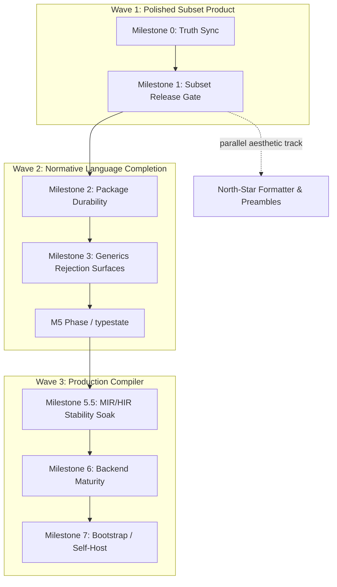
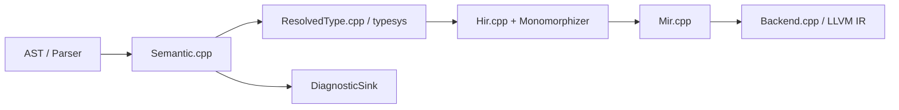

# Finish Evident: Compiler, Language, and Bootstrap Design

**Author:** Systems Architecture (design session)  
**Date:** 2026-06-27 (revised post-review)  
**Status:** Draft  
**Repository:** `C:\Users\Daniel\evident`

---

## Overview

Evident is a proof-oriented programming language with an explicit permit model, affine value discipline, and consequence-first naming. The checked-in tree is a **working C++23 seed compiler** for a **polished subset** of the normative language in `docs/EVIDENT_LANGUAGE_SPEC.md`, not a broken prototype. The eight-stage pipeline (`Source → Lexer → Parser → Semantic → HIR → MIR → LLVM IR → Native Emit`) is implemented in `src/` with public interfaces in `include/evident/`, orchestrated by `Driver.cpp`, and regression-tested through a large CTest corpus.

**CTest truth-sync is a three-way mismatch today** (verified in tree):

| Source | Value | Location |
|--------|-------|----------|
| CMake expectation | **407** | `CMakeLists.txt:121` (`EVIDENT_EXPECTED_CTEST_TOTAL`) |
| CI / workflow contract | **404** | `.github/workflows/ci.yml:246,376`; `cmake/AssertCiWorkflow.cmake:41` |
| Planning / release docs | **404/404** | `docs/COMPILER_FINISH_PLAN.md`, `docs/RELEASE_CHECKLIST.md`, `cmake/AssertReleaseDocs.cmake` |
| Stale local configure | **405** | Prior `build/windows-x64-ninja` tree registered fewer tests than current `CMakeLists.txt` |

Until PR-01 lands, treat the CTest named **`validate_ctest_total_contract`** as the authoritative pass/fail signal for count alignment — not ad-hoc `LastTest.log` excerpts (stale configures report `NOT_AVAILABLE` tests as "Passed").

“Finish” has three legitimate definitions from `docs/COMPILER_FINISH_PLAN.md`:

1. **Polished subset compiler** — ship the current implemented surface with reliable Windows x64 native emission, golden diagnostics, and evidence-bound release workflow.
2. **Larger language compiler** — close remaining normative gaps (generics rejection-surface narrowing, optional phase-transition spec extension, package durability) while honoring spec deferrals (notably **no traits** until the spec is amended).
3. **Self-hosting compiler** — C++ seed builds stage-1 Evident `evidc`, stage-1 builds stage-2, stage-2 passes staged equivalence gates (`docs/BOOTSTRAP_PLAN.md`).

This design recommends a **three-wave staged path** that does not block correctness on north-star aesthetics, maps `docs/RUST_DESIGN.md` / `docs/CPP_DESIGN.md` invariant discipline onto both Evident semantics and compiler internals, and sequences backend investment after language-facing IR contracts stabilize.

---

## Background & Motivation

### Current state (verified against tree)

| Area | Status | Primary locations |
|------|--------|-------------------|
| Pipeline | 8 stages operational | `src/Driver.cpp`, `src/Lexer.cpp` … `src/Backend.cpp` |
| Tests | **147** registered `expected_invalid_*.diag.out` goldens; release/CI/native contracts | `tests/`, `cmake/Assert*.cmake`, `CMakeLists.txt` |
| Permit model | `grants`, `grant … as name { … }`, `as name` args | `src/Semantic.cpp`, `src/Mir.cpp` (`ScopedAuthority`) |
| Generics | **Foundation explicit instantiation largely works end-to-end**; `Driver.cpp:308` calls `hir::monomorphize_for_backend` before MIR/backend; native tests pass (`run_native_generic_function_call`, `run_native_generic_record_construct`, nested/multi-instantiation, affine paths). Backend `!generics.empty()` guards reject **uninstantiated** decls at emission sites, not monomorphized instances | `src/Hir.cpp:3240`, `src/Backend.cpp:1220,1284,1300,1657,2226,5528` |
| Traits | Parser rejects `trait`/`impl` | `src/Parser.cpp:458–464` |
| Package model | Multi-file, `--package`, `evident.pkg`, `import` gate | `src/Driver.cpp`, `src/Semantic.cpp` |
| Collections | Compiler-owned `List`/`Map` families through semantic → native ABI | `src/Semantic.cpp`, `src/Backend.cpp` |
| Phase/typestate | Affine phase types, module-local construction; spec §15 `validate` example **allows** field reads on `AppConfig::Draft` parameter — no consume-on-transition rule in current spec | `tests/valid_phase_transition.evd` (parse-only) |
| Backend | `x86_64-pc-windows-msvc`, alloca-heavy LLVM IR, `evid$` mangling (`Backend.cpp:292–305`), COFF/PE validation | `src/Backend.cpp`, `docs/NATIVE_BACKEND_PLAN.md` |
| Bootstrap | Compilable scaffold with `seed_*` stubs (`pipeline.evd:56–88`, `lexing.evd`), not compiler | `bootstrap/compiler/`, `src/bootstrap_runtime.cpp` |
| C++ contract discipline | Escape-hatch scan + synthetic rejection | `cmake/AssertCppDesignEscapeHatches.cmake` |
| Release | Evidence-bound Windows x64 ZIP/checksum/attestation | `docs/RELEASE_CHECKLIST.md`, `.github/workflows/ci.yml` |

**Verification ritual (M0 exit):** Fresh `cmake --preset windows-x64-ninja && cmake --build --preset windows-x64-ninja && ctest --preset windows-x64-ninja` on an x64 VS developer shell; `validate_ctest_total_contract` must pass with configure-derived total propagated to CI workflow fragments.

### Pain points

1. **Definition drift** — CTest count diverges across CMake (407), CI (404), docs (404), and stale build trees (405); `COMPILER_FINISH_PLAN.md` still lists active Milestone 4 (traits) despite spec deferral.
2. **IR instability risk** — backend SSA/portability work before generics rejection surfaces and optional phase rules settle may require rework.
3. **Phase/typestate scope creep** — treating consume-on-transition as a spec bug misreads §12.6/§15; it is a **proposed extension** requiring spec amendment before compiler enforcement.
4. **Bootstrap cliff** — scaffold models pipeline as data; `seed_*` functions must become real implementations; host runtime lacks directory enumeration needed for slice 1.
5. **North star vs grammar** — specimen syntax is ahead of compiler; aesthetic goals land incrementally.

### Authority stack

1. `docs/EVIDENT_LANGUAGE_SPEC.md` — normative language contract (permit model: **not** `opens`/ambient authority).
2. `docs/EVIDENT_NORTH_STAR.md` — aspirational readability; preserve spirit, not specimen keywords.
3. `docs/RUST_DESIGN.md` / `docs/CPP_DESIGN.md` — modeling discipline for Evident programs **and** compiler repo-defined surfaces.
4. `docs/COMPILER_FINISH_PLAN.md`, `BOOTSTRAP_PLAN.md`, `NATIVE_BACKEND_PLAN.md`, `RELEASE_CHECKLIST.md` — execution plans (updated as milestones land).

---

## Goals & Non-Goals

### Goals

| ID | Goal | Success signal |
|----|------|----------------|
| G1 | Ship **polished subset** on Windows x64 with accurate docs and green CI | `ctest --preset windows-x64-ninja` passes; release checklist satisfied |
| G2 | Close **normative language gaps** without spec violations | Spec §17 rejections + positive paths covered by goldens and native tests |
| G3 | **Narrow generic rejection surfaces** to zero for spec-allowed foundation forms (explicit args only) | Inventory table below stays green; no new `generics.empty()` backend rejects on monomorphized paths |
| G4 | **Phase-transition rules (default path)** — spec amendment then enforcement (PR-17–20) | Amended §12.6/§15 + regression corpus; A6 alternative defers to status-quo affine field-use |
| G5 | **Bootstrap evidence** — seed → stage-1 → stage-2 staged equivalence | `BOOTSTRAP_PLAN.md` gates + release evidence sections |
| G6 | Apply **type-driven design** to compiler internals | Expanded escape-hatch coverage; `UseDiscipline`/`Closed` patterns |
| G7 | Land **north-star qualities** incrementally | Formatter, naming diagnostics, optional preambles — none block G1 |

### Non-Goals (this finish plan)

- **Generic type inference** — explicitly forbidden by spec §16.1.
- **Trait / impl / open polymorphism** — spec §16 and §18 **[Deferred]**; `COMPILER_FINISH_PLAN.md` Milestone 4 marked **deferred pending spec amendment** in PR-01/PR-02.
- **C as production backend** — `NATIVE_BACKEND_PLAN.md` rejects transpilation as final proof.
- **Hermetic bit-for-bit reproducible releases** — current promise is evidence-bound rebuildability.
- **North-star specimen syntax wholesale** — `book`/`law`/`theorem` blocks are future surface.
- **Cross-package linking / version constraints** — spec §5 and §18 deferred.
- **Removing C++ seed from default build** — post-1.0 only (PR-46); seed retained for bisection and platform bring-up.

---

## Proposed Design

### Three-wave finish strategy



### Reconciling the three “finish” definitions

| Finish definition | Wave | Exit criterion |
|-------------------|------|----------------|
| Polished subset | Wave 1 complete | Subset release gate without bootstrap claims |
| Larger language (spec-conformant) | Wave 2 complete | Non-deferred spec sections implemented; consume-on-transition on default path (PR-17–20); traits deferred |
| Self-hosting | Wave 3 complete | `BOOTSTRAP_PLAN.md` five-point definition + staged equivalence evidence |

### Architecture: category discipline through the pipeline



**Monomorphization choke point:** `Driver.cpp:308` — `hir::monomorphize_for_backend(package)` runs **before** MIR and backend. Backend sees concrete instances; `!decl.generics.empty()` guards are decl-emission sentinels for paths that bypass monomorphization.

**Category enforcement map:**

| Category | Semantic | ResolvedType | HIR | MIR | Backend |
|----------|----------|--------------|-----|-----|---------|
| `permit` | `PermitTypePolicy`, `check_grants_clause_*` | `ScopedAuthority` | No stored permit locals | Authority scopes | Erased |
| `proof` | `prove` context, affine reuse | `Affine` | Proof nodes | Move semantics | Aggregate layout |
| `phase` | Construction visibility | Affine classification | Phase constructors | Move semantics | `evid$` mangled symbols |
| `reason` | `fails`/`fail`/`try` | Contract rules | Invoke + switches | Yield wrappers | Tagged union ABI |
| Generics | Foundation quarantine | `TypeFlavor::Generic` | `Monomorphizer` | Concrete instances | Rejects uninstantiated decls only |

### Wave 1: Polished subset (Milestones 0–1)

#### M0 — Truth sync

**Single configure-time source of truth (resolves Open Question #6):**

1. **Configure order:** Remove the manual `EVIDENT_EXPECTED_CTEST_TOTAL` assignment at `CMakeLists.txt:121` (currently **before** test registration). Register all ordinary tests first via `add_test` / `add_*_test` macros that increment a configure-time counter (e.g. `EVIDENT_CTEST_REGISTRATION_COUNT`). Then `include(cmake/CountCtest.cmake)` at the **end** of `CMakeLists.txt` sets `EVIDENT_EXPECTED_CTEST_TOTAL` from that counter (cross-check with post-configure `ctest -N`).
2. **Contract-test ordering (critical):** CMake expands `${EVIDENT_EXPECTED_CTEST_TOTAL}` in `add_test(COMMAND …)` at **configure time**, not at test execution. The three contract tests that embed the total — `validate_release_evidence_contract`, `validate_ctest_total_contract`, and `validate_ctest_total_rejects_stale_count` (`CMakeLists.txt:187–205` today) — MUST be **relocated to immediately after** `include(cmake/CountCtest.cmake)`. If they remain before the include, they receive an empty or stale `-DEXPECTED_CTEST_TOTAL` and the truth-sync fix silently fails. Alternative: refactor `add_*_test` macros to increment the counter and set `EVIDENT_EXPECTED_CTEST_TOTAL` before any contract test references it (same outcome — total known before contract `add_test` calls).
3. **Count method:** Prefer counting `add_test` registrations during configure (reliable on first configure). Use post-configure `ctest -N` only as a cross-check, not the primary source on cold configure.
4. **Conditional tests:** Platform-gated or `if()`-wrapped registrations MUST increment the same counter (or register into a tracked list) so the total matches the enabled matrix on Windows x64 CI.
5. Generate `cmake/generated/CiWorkflowCTestTotal.cmake` fragment consumed by `AssertCiWorkflow.cmake` and release-evidence writers.
6. Update **all** consumers in one PR: `CMakeLists.txt`, `.github/workflows/ci.yml`, `cmake/AssertReleaseDocs.cmake`, `cmake/RunReleaseDocsAndAssert.cmake`, `docs/COMPILER_FINISH_PLAN.md`, `docs/RELEASE_CHECKLIST.md`, `README.md`, `AGENTS.md`.
7. Require fresh `windows-x64-ninja` reconfigure; delete stale `build/windows-x64-ninja` or re-run configure before claiming sync.
8. Mark `COMPILER_FINISH_PLAN.md` Milestone 4 (traits) **Deferred — pending spec amendment**; rewrite Near-Term Priority to match three-wave plan.

**M0 exit criteria:** `validate_ctest_total_contract` passes; `validate_ci_workflow_contract` passes; `validate_release_docs_contract` passes; no manual `404` fragments remain.

#### M1 — Subset release bar

1. **Diagnostic breadth** — corpus is **147** registered `expected_invalid_*.diag.out` files (`CMakeLists.txt`); Wave 1 target: +10–15 new malformed-parser/recovery goldens (→ ~160).
2. **Backend artifact depth** — COFF relocation bounds; extended PE checks.
3. **Toolchain hardening** — document `EVIDENT_CLANG`; Linux dev path docs only until M6.
4. **CLI documentation** — document **existing** flags (`--target`, `--package`, emission modes) in M0/M1; do not relabel as new work.

### Wave 2: Normative language completion

#### M2 — Package durability

Within spec §5 source-set boundary (external package linking remains §18 deferred):

| Feature | Now | Target |
|---------|-----|--------|
| Source discovery | Recursive `.evd` or manifest | Unchanged |
| Package identity | Implicit | Optional `package <id>;` directive |
| Internal dep graph | Module merge | Optional `depends <id>;` — **metadata only**, single-package TU |
| Cross-package linking | Deferred | Stay deferred |

**`evident.pkg` grammar (normative for PR-10/11):**

```ebnf
manifest      = { manifest_line } ;
manifest_line = package_decl | depends_decl | source_path | comment ;
package_decl  = "package" identifier ";" ;
depends_decl  = "depends" identifier ";" ;
source_path   = relative_evd_path newline ;
comment       = "#" { any_char } newline ;
identifier    = lowercase { lowercase | digit | "." | "_" } ;
```

**Validation rules:**

- At most one `package` line; duplicate → `package identity declared more than once`.
- `depends` lines list internal metadata edges only; duplicate `depends` → reject; unknown id → reject when cross-checked against `package` identity graph.
- `depends` does **not** enable external linking (spec §18); bootstrap package may declare `depends evident.compiler` for documentation/validation only.
- Existing path-only manifests remain valid.

#### M3 — Generics: rejection-surface narrowing (not “first native emission”)

**Baseline — already passing (do not re-implement):**

| Test / area | Coverage |
|-------------|----------|
| `run_native_generic_function_call` | Explicit generic fn → native exe |
| `run_native_generic_record_construct` | Explicit generic record → native |
| `run_native_nested_generic_record_construct` | Nested type args |
| `run_native_multiple_generic_instantiations` | Multiple instances same TU |
| `run_native_generic_affine_*` | Affine propagation paths |
| HIR/MIR goldens | `dump_*_generic_*` tests |
| Negative | `expected_invalid_generic_*` diagnostics |

**Remaining work — map each `Backend.cpp` `generics.empty()` site:**

| Line (approx) | Guard context | PR owner |
|---------------|---------------|----------|
| 1220 | Type/layout decl emission | PR-12 |
| 1284 | `main` entry | PR-12 (keep reject — `main` must not be generic) |
| 1300 | Type decl layout | PR-13 |
| 1657 | Function collection | PR-12 |
| 2226 | HIR function lowering | PR-12 |
| 5528 | Call callee | PR-12 |

**Target:** Guards fire only for **uninstantiated** generic decls that reach backend without monomorphization — not for monomorphized `qualified_name` instances. Extend Monomorphizer coverage for edge cases (foreign/boundary paths, multi-arity nesting) per `COMPILER_FINISH_PLAN.md` Milestone 3.

**Mangling:** Existing scheme is `evid$` + sanitized `qualified_name` (`Backend.cpp:292–305`). Monomorphizer encodes type args in `qualified_name`. **No new `module__fn__Int` scheme** unless collision reproducer found. PR-16 verifies link uniqueness under existing mangling.

#### M5 — Phase / typestate (proposed extension — spec amendment required)

**Current normative behavior (spec-aligned):**

- §12.6: affine discipline, module-local construction, no matching on concrete phase types.
- §15 example: `validate(config: AppConfig::Draft)` reads `config.id` / `config.payload` — **valid** today.
- §14.4: stable authority/minting contract; line 1163 permits future typestate syntax that does not weaken authority rules — **does not** authorize consume-on-transition by itself.

**Proposed extension (not normative until amended):**

PR-17 updates `docs/EVIDENT_LANGUAGE_SPEC.md` **before** compiler enforcement:

1. New §12.7 or §14.6 **Phase family transitions** defining:
   - A function returning position `P2` of family `F` that accepts position `P1` of the same family (`P1 ≠ P2`) MUST take the source as an **ordinary by-value parameter** (affine move at call site).
   - **Consumption point:** the parameter binding is **moved into** the callee at entry (standard affine `let`/parameter bind). Field accesses on that binding are permitted until the **whole phase value** is moved to another call, returned, or the binding goes out of scope. After a whole-value move, the binding is dead (existing affine reuse rules).
   - Reconcile §15 `validate` example to either consume `config` when constructing `Validated` or rename to show explicit move pattern.
2. Optional `proves TransitionReceipt` on public transition APIs (product decision — **resolved:** optional; see User Decisions).

Until PR-17 merges spec text, M5 compiler enforcement is **blocked**; status-quo affine field-use remains until PR-17 lands on the default path.

**Wave 2 exit tracks (choose one):**

| Track | PRs | Wave 2 complete when | Blocks PR-25? |
|-------|-----|----------------------|---------------|
| **Phase (default)** | PR-10–20 | Generics rejection surfaces closed; package manifest done; amended spec + transition enforcement | **Yes** — PR-25 gates on PR-15 + PR-16 + **PR-19** |
| **A6 (alternative)** | PR-10–16; skip PR-17–20 | Generics rejection surfaces closed; package manifest done | No — PR-25 gates on PR-15 + PR-16 only |

**Default critical path:** PR-17 (spec amendment) → PR-18–20 (compiler + goldens) **before** Wave 3 backend/bootstrap. Alternative A6 remains documented for teams that defer consume-on-transition.

### Wave 3: Backend maturity + bootstrap

#### Milestone 5.5 — MIR/HIR stability soak (operational gate)

**Enforced by PR-25** (not aspirational policy):

- Checkpoint PR between Wave 2 and Wave 3 backend SSA work.
- **Hard dependencies (default Phase track):** **PR-15** (generic affine) + **PR-16** (mangling uniqueness) + **PR-19** (phase transition tests) merged. **PR-11** (package manifest validation) recommended for package IR stability. **A6 alternative:** PR-19 not required — soak may proceed after PR-15 + PR-16 only.
- **Gate criteria:** two consecutive calendar weeks on `main` with (a) zero HIR/MIR golden churn PRs unrelated to merged Wave 2 generics/package/phase work, (b) green `ctest --preset windows-x64-ninja`, (c) signed checklist in `docs/COMPILER_FINISH_PLAN.md` by compiler maintainer. Phase-track soak includes phase golden stability; A6 waiver documented on checklist if PR-17–20 skipped.
- PR-26+ (SSA) **blocked** on PR-25 merge.

#### M6 — Backend maturity

| Item | Approach | Rollback |
|------|----------|----------|
| SSA locals | Per-construct migration PRs | `EVIDENT_BACKEND_ALLOCA_FALLBACK=ON` CMake option keeps alloca path until PR-29 completes |
| SSA calls/yields | Separate PR | Same fallback |
| SSA variants/aggregates | Separate PR | Same fallback |
| SSA collections | Separate PR | Remove fallback after parity tests |
| Debug `-g` | Driver → clang | N/A |
| Opt `-O0`/`-O2` | Driver → clang | N/A |
| Linux ELF dev target | WSL/dev validation only (PR-32/33) | **Windows x64 sole release target**; seed MSVC remains production triple |

`Backend.cpp` is ~6.7k lines; SSA migration is **four PRs** (PR-26–29), not 2.

#### M7 — Bootstrap / self-host

**Feasibility bounds:**

| Slice | Est. effort | Critical-path? | Demo gate |
|-------|-------------|----------------|-----------|
| Host I/O expansion | 2–3 engineer-weeks | **Yes** | Directory listing returns bootstrap manifest paths |
| 1 Source/discovery | 3–4 weeks | **Yes** | Package graph parity with C++ on `bootstrap/compiler` |
| 2 Lexer | 4–6 weeks | Yes | Token byte-match on 20-fixture corpus |
| 3 Parser | 6–8 weeks | Yes | Parse `bootstrap/compiler` package |
| 4 Diagnostics | 3–4 weeks | Yes | Renderer match on subset |
| 5 Semantic | 10–14 weeks | **Yes (long pole)** | 30% reject corpus |
| 6 HIR/MIR | 10–12 weeks | **Yes (long pole)** | 10 HIR/MIR goldens |
| 7 Driver/backend | 6–8 weeks | Yes | Stage-1 emits one native smoke exe |
| Harness + equivalence | 4–6 weeks | Yes | Staged tiers → full corpus |

**Total critical path:** ~9–14 engineer-months for one experienced compiler engineer; **+30–40% buffer** for equivalence debugging. Minimum viable bootstrap (MVB): stage-1 compiles **only** `bootstrap/compiler` + 5 fixture programs (not full `ctest`) by PR-42.

**Scaffold gap:** `pipeline.evd` `compile_with_seed` / `seed_token_stream` are identity stubs — port replaces stubs per slice, not a small-file-count tweak.

**Bootstrap harness (concrete — no fictional preset):**

```text
cmake --build build/windows-x64-ninja --target bootstrap_stages
  → build/bootstrap/stage1/evidc.exe, stage2/evidc.exe
  → cmake/RunBootstrapStages.cmake equivalence driver
```

PR-34 introduces target `bootstrap_stages`; **does not** add `windows-x64-ninja-bootstrap` to `CMakePresets.json` until a second preset is justified.

**Host foreign ABI surface (per slice):**

| Foreign hook | `bootstrap_host.evd` | `bootstrap_runtime.cpp` | Needed by slice |
|--------------|----------------------|-------------------------|-----------------|
| `read_text_file_text` | ✓ | ✓ | 1+ |
| `write_text_file_text` | ✓ | ✓ | 4+ |
| `resolve_path_text` | ✓ | ✓ | 1+ |
| `spawn_tool_text` | ✓ | ✓ | 7 |
| `list_directory_text` | **PR-34** | **PR-34** | **1** |
| `append_diagnostic_text` | **PR-34** | **PR-34** | **4** |

**Staged equivalence tiers** (replaces day-one full corpus requirement):

| Tier | PR | Compare |
|------|-----|---------|
| T0 | PR-42 | Token dumps, 5 fixtures |
| T1 | PR-43 | + AST dumps, bootstrap package |
| T2 | PR-43 | + 30% diagnostic goldens; **normalized LLVM IR diff** vs seed |
| T3 | PR-43 | + HIR/MIR goldens (10 fixtures); **normalized LLVM IR diff** vs seed |
| T4 | PR-45 | + full `diag_*` + `expected_invalid_*.diag.out` corpus; CLI tripwires; **byte-identical** LLVM IR / artifacts where applicable |

Byte-identical `evidc.exe` remains aspirational; **byte-identical LLVM IR required only at T4** (T2/T3 use normalized textual IR diff).

### North-star aesthetic track (parallel)

Unchanged in spirit; formatter/preambles non-blocking. Phase transition **receipts** (PR-20) are **optional** on the default Phase track — spec amendment (PR-17) and enforcement (PR-18–19) proceed without mandatory `proves` receipts.

### Type-driven design for compiler internals

Unchanged; expand escape-hatch contracts. **No `EVIDENT_ENABLE_*` semantic flags** — language rules ship via normal merge + golden updates (see Rollout).

---

## API / Interface Changes

### CLI (Driver)

#### Existing — document in Wave 1 (already in `src/main.cpp`)

| Flag | Notes |
|------|-------|
| `--target <triple>` | Implemented; default `x86_64-pc-windows-msvc` (lines 36, 156) |
| `--package <dir>` | Package compilation |
| `--print-toolchain`, `--check-toolchain` | Toolchain introspection |
| `--emit-llvm/asm/obj/exe`, `--dump-*` | Emission / debug dumps |
| Multiple input files | Package TU |

#### New — implement in Wave 2–3

| Flag | Wave | Notes |
|------|------|-------|
| `--format [path]` | W2 | Pretty-print only |
| `-O0`, `-O2` | W3 M6 | Forward to clang; default `-O0` |
| `-g` | W3 M6 | Debug info |
| `--bootstrap-stage {1,2}` | W3 M7 | Internal harness |
| Linux triple via `--target` | W3 M6 | **WSL/dev validation only** (PR-32/33); Windows x64 remains sole release target |

### Language surface

| Construct | Wave | Change |
|-----------|------|--------|
| Phase transitions | W2 M5 | **Only after spec amendment (PR-17)** |
| `evident.pkg` | W2 M2 | `package` + `depends` directives |
| Generic calls | W2 M3 | Narrow backend rejection surfaces |
| Traits | — | Deferred until spec §18 amended |

---

## Data Model Changes

### `evident.pkg` manifest

```text
# evident.pkg — full example
package evident.compiler
depends evident.compiler.core

src/main.evd
src/lexing.evd
```

See M2 EBNF for validation rules. `depends` is metadata-only within single-package TU.

### HIR `Package` post-monomorphization

- `FunctionDecl::generics` empty on emitted functions after `monomorphize_for_backend`.
- Mangling: **`evid$<sanitized-qualified-name>`** unchanged; PR-16 adds collision tests only.

### Release evidence

```text
[bootstrap stages]
seed_compiler=...
stage1_compiler=...
stage2_compiler=...
equivalence_tier=T4
equivalence_manifest=bootstrap/equivalence-manifest.txt
```

---

## Alternatives Considered

### A1–A5

Unchanged (traits, inference, C transpile, big-bang, north-star syntax).

### A6: Enforce only affine field-use rules (status quo)

**Alternative track — not default.** Keep §15 `validate` behavior: phase parameters are affine at the binding level, field reads permitted, no mandatory consume-on-transition.

*Trade-off:* Weaker lifecycle story vs zero spec churn; north-star “typography of lifecycle” deferred. Teams may select A6 to defer PR-17–20; **default path** adopts consume-on-transition (User Decisions 2026-06-27).

---

## Security & Privacy Considerations

Unchanged (path traversal, `CreateProcessW`, ZIP validation, offline compiler).

---

## Observability

| Signal | Mechanism | Consumer |
|--------|-----------|----------|
| Compile success/fail | Exit code + `DiagnosticSink` | CLI, CI |
| Stage timing | `EVIDENT_TRACE_TIMINGS=1` (PR-03) | Profiling |
| MIR/HIR dumps | `--dump-hir`, `--dump-mir` | Tests, bootstrap |
| Bootstrap equivalence | Tiered manifest per PR-43/45 | `BOOTSTRAP_PLAN.md` |
| CTest truth | `validate_ctest_total_contract` | Release gate |

**Bootstrap metrics:** Tier T4 (PR-45) requires full diagnostic golden corpus match and byte-identical LLVM IR where applicable; T2/T3 use **normalized LLVM IR textual diff**; earlier tiers use explicit growing manifest (`bootstrap/equivalence-manifest.txt`).

---

## Rollout Plan

### Build options (not semantic feature flags)

- `EVIDENT_BOOTSTRAP_HARNESS=ON` — CMake option enabling `bootstrap_stages` target (off until M7).
- `EVIDENT_BACKEND_ALLOCA_FALLBACK=ON` — SSA rollback during PR-26–29 migration.

**Dropped:** `EVIDENT_ENABLE_PHASE_TRANSITION_PROOF` — language semantics ship through normal merge + golden updates; no dual semantic CI matrix.

### Staged rollout

1. **W1** — subset tag `v0.x`; no bootstrap claims.
2. **W2 — Phase track (default):** complete PR-10–20 (PR-17 spec amendment → PR-18–20 enforcement); proceed to PR-25 soak (requires PR-19).
3. **W2 — A6 track (alternative):** complete PR-10–16; skip PR-17–20; PR-25 soak after PR-15 + PR-16 only.
4. **W3** — bootstrap evidence at T4 on release tags (Windows x64).

---

## User Decisions (2026-06-27)

| OQ | Decision | Implementation impact |
|----|----------|----------------------|
| **#2** | **Phase track is default.** Spec amendment (PR-17) + consume-on-transition enforcement (PR-18–20) on the default critical path **before** Wave 3 backend/bootstrap. Transition `proves` receipts (PR-20) remain **optional**. A6 (status-quo affine field-use) stays documented as an **alternative**, not the default. | Mermaid, Wave 2 exit tracks, Rollout, KD4, KD9, PR-17/PR-25 deps |
| **#3** | **WSL/dev-only Linux.** Windows x64 is the **sole release target**. PR-32/33 validate ELF emission under WSL for developer workflows only; `docs/RELEASE_CHECKLIST.md` unchanged. | M6 table, CLI `--target` notes, PR-32/33 scope |
| **#4** | **Formatter includes `match`/arm reflow.** PR-22 delivers broader structural pretty-print, not layout-only. | PR-22 summary |
| **#5** | **Normalized LLVM IR diff at T2/T3; byte-identical only at T4.** Staged equivalence tolerates normalized textual IR comparison through T3; T4 requires byte-identical LLVM IR / artifacts where applicable. | Equivalence tiers table, Observability, PR-43/45 |

---

## Open Questions

1. **Spec amendment for traits?** — stay monomorphic until self-host unless §16/§18 amended.
2. ~~**Phase transition proofs mandatory or optional?**~~ — **Resolved (2026-06-27):** Phase track is **default** (PR-17–20 before Wave 3); `proves` receipts on PR-20 remain **optional**. A6 is alternative only.
3. ~~**Linux as second target vs WSL-only dev**~~ — **Resolved (2026-06-27):** WSL/dev-only validation (PR-32/33); Windows x64 sole release target; release checklist unchanged.
4. ~~**Formatter scope**~~ — **Resolved (2026-06-27):** PR-22 includes `match`/arm reflow and broader structural pretty-print.
5. ~~**Stage equivalence tolerance**~~ — **Resolved (2026-06-27):** Normalized LLVM IR textual diff at T2/T3; byte-identical LLVM IR / artifacts required only at T4.
6. ~~**`EVIDENT_EXPECTED_CTEST_TOTAL` automation**~~ — **Resolved:** configure-time `ctest -N` capture in PR-01.

---

## References

(Unchanged paths; `AGENTS.md` at repo root.)

---

## Key Decisions

| # | Decision | Rationale |
|---|----------|-----------|
| KD1 | Three-wave sequencing | Reduces backend churn |
| KD2 | Spec wins on traits; finish-plan Milestone 4 deferred in PR-01 | Prevents trait work from stale plan |
| KD3 | Explicit monomorphization; narrow rejection surfaces | Matches implementation reality (`Driver.cpp:308`) |
| KD4 | Phase consume-on-transition is **proposed spec extension** adopted on **default path** (PR-17–20) | §12.6/§15 do not require it today; A6 remains alternative for deferred adoption |
| KD5 | Native bootstrap proof | `BOOTSTRAP_PLAN.md` |
| KD6 | Vertical-slice port with MVB | Feasibility bounds |
| KD7 | North-star via formatter, not grammar fork | Non-blocking aesthetics |
| KD8 | Expand escape-hatch contracts | `CPP_DESIGN.md` |
| KD9 | **PR-25 soak gate** after PR-15+PR-16+**PR-19** on default Phase track | A6 alternative unblocks Wave 3 without PR-17–20 (PR-19 waived) |
| KD10 | Tiered equivalence → T4 full corpus | Practical incremental bootstrap |
| KD11 | Keep `evid$` mangling; test uniqueness only | Avoid link/test churn |
| KD12 | Configure-time CTest total **after ordinary test registrations; contract tests after CountCtest** | Ends 404/405/407 drift; avoids stale `-DEXPECTED_CTEST_TOTAL` in contract `add_test` |
| KD13 | PR-46 seed removal post-1.0 only | Bisection/onboarding safety |

---

## PR Plan

**PR count: 46** (renumbered from review feedback)

### Wave 1 — Truth sync & subset release

**PR-01: Configure-time CTest total + full consumer sync**  
- *Files:* `CMakeLists.txt` (remove line-121 manual total; register ordinary tests first; `include(cmake/CountCtest.cmake)`; **then** relocate `validate_release_evidence_contract`, `validate_ctest_total_contract`, `validate_ctest_total_rejects_stale_count` blocks to immediately after the include), `cmake/CountCtest.cmake`, `cmake/generated/CiWorkflowCTestTotal.cmake`, `.github/workflows/ci.yml`, `cmake/AssertCiWorkflow.cmake`, `cmake/AssertReleaseDocs.cmake`, `cmake/RunReleaseDocsAndAssert.cmake`, `docs/COMPILER_FINISH_PLAN.md` (Milestone 4 → deferred, Near-Term Priority), `docs/RELEASE_CHECKLIST.md`, `README.md`, `AGENTS.md`  
- *Deps:* none  
- *Summary:* Count all ordinary `add_test` registrations; set `EVIDENT_EXPECTED_CTEST_TOTAL` via `CountCtest.cmake`; register CTest-total contract tests **after** the variable is set (CMake expands `-DEXPECTED_CTEST_TOTAL=${EVIDENT_EXPECTED_CTEST_TOTAL}` at configure time); cross-check with `ctest -N`; propagate to CI fragment; eliminate 404/405/407 drift.

**PR-02: Implemented-vs-Spec matrix in README**  
- *Files:* `README.md`  
- *Deps:* PR-01  

**PR-03: Optional compile timing trace**  
- *Files:* `src/Driver.cpp`, `include/evident/Driver.hpp`, `AGENTS.md` (repo root)  
- *Deps:* none  

**PR-04: Parser recovery golden expansion (batch 1)**  
- *Files:* `tests/invalid_parse_*.evd`, `tests/expected_invalid_parse_*.diag.out`, `CMakeLists.txt`  
- *Deps:* none  
- *Summary:* +10 malformed-input parser diagnostics beyond current corpus.

**PR-05: Semantic diagnostic golden expansion (authority batch)**  
- *Files:* `tests/invalid_*grant*`, `tests/invalid_*prove*`, `CMakeLists.txt`  
- *Deps:* none  
- *Summary:* Broaden permit/proof escape regression coverage.

**PR-06: COFF relocation table validation**  
- *Files:* `cmake/AssertCoffObjectFile.cmake`, native object test fixtures, `CMakeLists.txt`  
- *Deps:* none  
- *Summary:* Validate relocation bounds for emitted `.obj` tests.

**PR-07: PE optional header extended checks**  
- *Files:* `cmake/AssertPeExecutableFile.cmake`, native executable test fixtures  
- *Deps:* PR-06  
- *Summary:* Deeper PE structure validation beyond current smoke.

**PR-08: Toolchain discovery documentation + negative tests**  
- *Files:* `README.md`, `tests/reject_toolchain_*`, `src/Backend.cpp`  
- *Deps:* none  
- *Summary:* Document `EVIDENT_CLANG` resolution order; golden missing-linker paths.

**PR-09: Subset release gate doc pass**  
- *Files:* `docs/RELEASE_CHECKLIST.md`, `docs/TOOLCHAIN_REPRODUCIBILITY.md`  
- *Deps:* PR-01, PR-02  
- *Summary:* Final alignment for v0.x subset tag checklist. M1 corpus baseline: **147** invalid diagnostic goldens.

### Wave 2 — Package, generics, typestate

**PR-10: `evident.pkg` grammar — `package` + `depends` parse**  
- *Files:* `src/Driver.cpp`, `src/Source.cpp`, tests  
- *Deps:* PR-02  
- *Summary:* EBNF from M2; rejection diagnostics listed in M2.

**PR-11: Package manifest semantic validation**  
- *Files:* `src/Semantic.cpp`, `bootstrap/compiler/evident.pkg`  
- *Deps:* PR-10  

**PR-12: Generic backend rejection inventory — functions/calls**  
- *Files:* `src/Backend.cpp` (lines ~1220, 1657, 2226, 5528), tests  
- *Deps:* none  
- *Summary:* Audit `generics.empty()` guards; ensure monomorphized instances pass; keep `main`-generic reject.

**PR-13: Generic backend rejection inventory — types/layout**  
- *Files:* `src/Backend.cpp` (~1300), tests  
- *Deps:* PR-12  

**PR-14: Monomorphizer edge-case coverage**  
- *Files:* `src/Hir.cpp`, tests  
- *Deps:* PR-12  

**PR-15: Generic affine propagation hardening**  
- *Files:* `src/Semantic.cpp`, `src/ResolvedType.cpp`, tests  
- *Deps:* PR-14  

**PR-16: Verify `evid$` mangling uniqueness for instances**  
- *Files:* `src/Backend.cpp`, `AGENTS.md`, link tests  
- *Deps:* PR-12, PR-13  
- *Summary:* Document existing `mangle_symbol_name`; add collision regression tests only.

**PR-17: Spec amendment — phase family transition rules (default path)**  
- *Files:* `docs/EVIDENT_LANGUAGE_SPEC.md` (§12.7 or §14.6, §15 example), `docs/COMPILER_FINISH_PLAN.md`  
- *Deps:* none  
- *Summary:* **Spec text before compiler enforcement**; includes consumption-point rules from M5. **Default critical path** — skip only on explicit A6 alternative selection.

**PR-18: Phase transition semantic enforcement**  
- *Files:* `src/Semantic.cpp`  
- *Deps:* **PR-17**  

**PR-19: Phase transition tests (HIR/native + rejections)**  
- *Files:* `tests/valid_phase_transition.evd`, `tests/invalid_phase_transition_*`  
- *Deps:* PR-18  

**PR-20: Optional transition `proves` receipts**  
- *Files:* `src/Semantic.cpp`, tests  
- *Deps:* PR-19  
- *Summary:* Optional strengthening on default Phase track; not required for PR-25 or Wave 3 entry.

**PR-21: Comment preamble tolerance (`file`/`title`/`about`)**  
- *Files:* `src/Parser.cpp`, `src/Lexer.cpp`, `tests/valid_preamble_*.evd`, `CMakeLists.txt`  
- *Deps:* none  
- *Summary:* North-star preambles as no-op surface syntax (ignored by semantic).

**PR-22: `evidc --format` pretty-printer (subset)**  
- *Files:* new `src/Format.cpp`, `src/main.cpp`, `include/evident/Format.hpp`, tests  
- *Deps:* PR-21  
- *Summary:* Structural pretty-printer including `match`/arm reflow and broader layout normalization; golden output tests.

**PR-23: C++ escape-hatch contract expansion**  
- *Files:* `cmake/AssertCppDesignEscapeHatches.cmake`, `include/evident/*`  
- *Deps:* none  
- *Summary:* Cover new modules; forbid raw `bool` in driver option structs.

### Wave 3 — Backend maturity

**PR-24: Driver emission mode ADT cleanup**  
- *Deps:* PR-23  

**PR-25: MIR/HIR stability soak checkpoint**  
- *Files:* `docs/COMPILER_FINISH_PLAN.md`, checklist template (`docs/MIR_STABILITY_SOAK.md`), optional CI calendar guard  
- *Deps:* **PR-15, PR-16, PR-19** (required on default Phase track); **PR-11** (recommended). **A6 alternative:** PR-19 waived; PR-17–20 skipped.  
- *Summary:* **Blocks PR-26+**; documents two green weeks; checklist records A6 waiver if phase work deferred.

**PR-26: SSA migration — scalar locals**  
- *Files:* `src/Backend.cpp`, `CMakeLists.txt` (`EVIDENT_BACKEND_ALLOCA_FALLBACK`)  
- *Deps:* **PR-25**  

**PR-27: SSA migration — calls and yields**  
- *Deps:* PR-26  

**PR-28: SSA migration — variants and aggregates**  
- *Deps:* PR-27  

**PR-29: SSA migration — collections; remove alloca fallback default**  
- *Deps:* PR-28  

**PR-30: `-O0`/`-O2` driver flags**  
- *Deps:* PR-26  

**PR-31: Debug info `-g`**  
- *Deps:* PR-30  

**PR-32: Linux ELF dev target — WSL validation only (backend implementation)**  
- *Deps:* PR-29  
- *Summary:* Dev/WSL smoke tests; **not** a release target. Windows x64 remains sole production triple.

**PR-33: Linux/WSL dev target documentation**  
- *Deps:* PR-32  
- *Summary:* Document WSL build/validation workflow; `docs/RELEASE_CHECKLIST.md` unchanged (Windows x64 only).

### Wave 3 — Bootstrap & self-host

**PR-34: Bootstrap harness + host I/O (`list_directory`, `append_diagnostic`)**  
- *Files:* `CMakeLists.txt` (`bootstrap_stages` target), `cmake/RunBootstrapStages.cmake`, `bootstrap/compiler/src/host.evd`, `src/bootstrap_runtime.cpp`  
- *Deps:* PR-11  
- *Summary:* **Before slice 1**; foreign ABI table in M7.

**PR-35: Slice 1 — source + discovery port**  
- *Files:* `bootstrap/compiler/src/source.evd`, `bootstrap/compiler/src/discovery.evd`, tests  
- *Deps:* **PR-34**  
- *Summary:* Package graph parity with C++ on `bootstrap/compiler` manifest.

**PR-36: Slice 2 — lexer port**  
- *Files:* `bootstrap/compiler/src/lexing.evd`, token golden tests, `CMakeLists.txt`  
- *Deps:* **PR-35**  
- *Summary:* Token stream parity with `Lexer.cpp` on 20-fixture corpus.

**PR-37: Slice 3 — parser port**  
- *Files:* `bootstrap/compiler/src/parsing.evd`, AST dump tests  
- *Deps:* **PR-36**  
- *Summary:* Parse `bootstrap/compiler` package itself.

**PR-38: Slice 4 — diagnostics renderer**  
- *Files:* `bootstrap/compiler/src/diagnostics.evd`, `src/bootstrap_runtime.cpp`  
- *Deps:* **PR-37**  
- *Summary:* Diagnostic renderer byte-match on subset corpus.

**PR-39: Slice 5 — semantic + ResolvedType port (subset)**  
- *Files:* `bootstrap/compiler/src/semantics.evd`, reject corpus subset tests  
- *Deps:* **PR-38**, **PR-15**, **PR-16** (generics rules stable for port)  
- *Summary:* Authority/affine/phase rules in Evident; 30% reject corpus gate.

**PR-40: Slice 6 — HIR/MIR port**  
- *Files:* new `bootstrap/compiler/src/hir.evd`, `mir.evd`, `pipeline.evd`  
- *Deps:* **PR-39**  
- *Summary:* HIR/MIR golden match on 10+ fixtures.

**PR-41: Slice 7 — driver + backend invocation**  
- *Deps:* PR-40 (not PR-30 — default `-O0` seed path sufficient)  

**PR-42: Stage-1 integration (MVB: bootstrap package + 5 fixtures)**  
- *Deps:* PR-41  

**PR-43: Stage-2 build + tiered equivalence (T0–T3)**  
- *Files:* `bootstrap/equivalence-manifest.txt`, `cmake/RunBootstrapStages.cmake`  
- *Deps:* PR-42  
- *Summary:* T2/T3 compare **normalized LLVM IR textual diff** vs seed; byte-identical IR deferred to T4 (PR-45).

**PR-44: Release evidence bootstrap section**  
- *Deps:* PR-43  

**PR-45: Bootstrap CI gate (T4 full corpus)**  
- *Deps:* PR-44  
- *Summary:* Budget ~20–30 min CI incremental; runs on release tags. T4 requires **byte-identical** LLVM IR / artifacts where applicable (normalized diff sufficient at T2/T3 only).

**PR-46: Post-1.0 — optional seed demotion (out of initial finish scope)**  
- *Deps:* PR-45 + **N≥2 releases** dual-build CI (seed + stage-2)  
- *Summary:* Seed retained for bisection/platform bring-up; not default developer path until post-1.0.

---

## Revision Summary

**2026-06-27 initial:** Three-wave plan from repo verification.

**2026-06-27 final (v3.1):** PR-01 contract-test ordering — `validate_*_ctest_total*` and `validate_release_evidence_contract` must register after `CountCtest.cmake` sets total (CMake configure-time expansion).

**2026-06-27 user decisions:** OQ #2–#5 resolved — Phase track default (PR-17–20 before Wave 3; PR-19 in PR-25 deps); WSL/dev-only Linux; PR-22 match reflow; normalized LLVM IR at T2/T3, byte-identical at T4. Added User Decisions section.

**2026-06-27 re-review (v3):** Addressed 6 re-review issues:

1. PR-25 decoupled from PR-19; gates on PR-15+PR-16; A6 vs Phase track table; mermaid/KD9/Rollout updated.
2. PR-36–39 restored with sequential slice deps.
3. PR-04–09 and PR-21–23 re-expanded with files/deps/summaries.
4. M0/PR-01: CTest count after all test registrations via `cmake/CountCtest.cmake`.
5. M6 SSA typo fixed (four PRs).
6. Overview drops fragile "CTest #10" index.

**2026-06-27 post-review (v2):** Addressed 20 review issues:

1. Three-way CTest blast radius; PR-01 includes `ci.yml`, `RunReleaseDocsAndAssert.cmake`, configure-time `ctest -N`; removed weak `LastTest.log` evidence.
2. M3 reframed as rejection-surface narrowing with baseline inventory; `Driver.cpp:308` monomorphization documented.
3. M5 labeled proposed spec extension; PR-17 spec amendment before PR-18; Alternative A6; consumption-point clarified.
4. `evid$` mangling documented; PR-16 scoped to uniqueness tests.
5. Host I/O moved to PR-34 before slice 1; foreign ABI table added.
6. PR-25 operational MIR soak gate; KD9 enforced.
7. Feasibility section with engineer-months, MVB, critical path.
8. Dropped semantic env flags; CMake-only bootstrap/SSA options.
9. `depends` EBNF and validation rules in M2.
10. Fixed `AGENTS.md` path.
11. Diagnostic corpus **147** count.
12. CLI table split existing vs new.
13. OQ #6 resolved (configure-time total).
14. PR-01 defers finish-plan Milestone 4.
15. PR-41 decoupled from `-O2` flags.
16. SSA split into PR-26–29 with alloca fallback.
17. Tiered equivalence T0–T4.
18. `validate_ctest_total_contract` as verification ritual.
19. `bootstrap_stages` target replaces fictional preset.
20. PR-46 post-1.0 with dual-build guardrails.